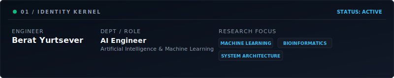
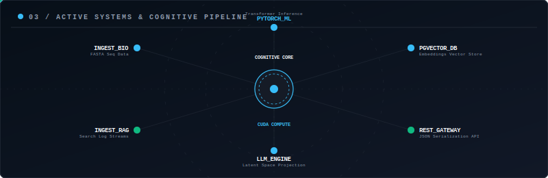
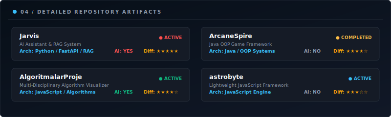
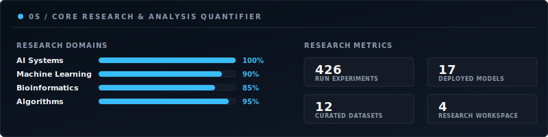
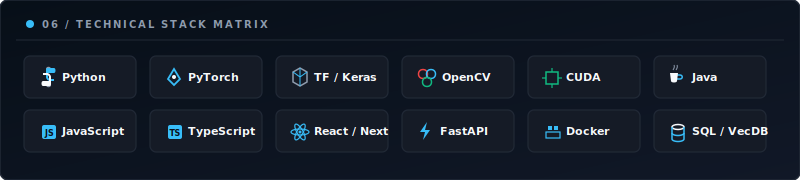
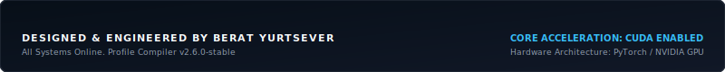

<!-- 01 / HERO MODULE -->
<!-- Renders cinematic boot header with system title and loading indicators -->

 

<!-- 02 / IDENTITY MODULE -->
<!-- Core information: Role, Department, and Research Focus -->

 

<!-- 03 / MISSION CONTROL MODULE -->
<!-- Live active projects progress and system health gauge -->

 

<!-- 04 / SYSTEM ARCHITECTURE MODULE -->
<!-- Animated data-flow systems pipeline showing web, API, inference and storage layers -->

 

<!-- 05 / DETAILED REPOSITORY ARTIFACTS -->
<!-- Modular project specification cards detailing game dev, visualizers, and web engines -->

 

<!-- 06 / CORE RESEARCH & QUANTIFIER -->
<!-- Domain knowledge matrix and dynamic experimental counters -->

 

<!-- 07 / TECHNICAL STACK MATRIX -->
<!-- Official flat-design technology shapes (Python, PyTorch, CUDA, etc.) -->

 

<!-- 08 / SYSTEMS FOOTER -->
<!-- Operating system details and system compile signatures -->

---

### 🧬 Profile OS Status Dashboard
Below is a compiled view of real-time server statistics drawn automatically from the GitHub API:

| Metric Type | Kernel Reading | Status Indicator |
| :--- | :--- | :--- |
| **Public Repositories** | ` 4 ` | `● ONLINE` |
| **Profile Followers** | ` 2 ` | `● ONLINE` |
| **Aggregated Stars** | ` 0 ` | `● ACTIVE` |
| **System Contributions** | ` 8 ` | `● STABLE` |

*ProfileOS Compiled automatically on: `2026-07-11 21:16:46 UTC`*
